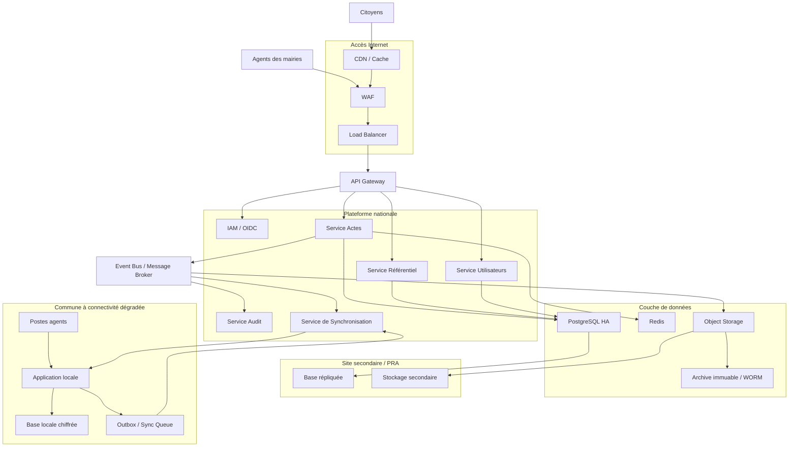

# Architecture cible – Plateforme nationale d'état civil

## 1. Contexte

Le projet consiste à concevoir une plateforme nationale d'état civil permettant :

- aux agents des mairies d'enregistrer les naissances, mariages et décès ;
- aux citoyens de demander leurs actes en ligne ;
- de garantir l'intégrité et la non-perte des actes ;
- de supporter des périodes de forte charge ;
- de continuer à fonctionner dans les communes où la connectivité Internet est instable ;
- de respecter les exigences de conservation légale et de traçabilité des données.

Deux contraintes majeures structurent l'architecture :

1. certaines communes peuvent subir des coupures réseau durant plusieurs heures ;
2. la charge peut atteindre ponctuellement plus de 10 fois le trafic normal.

La donnée d'état civil étant juridiquement sensible, l'architecture privilégie la fiabilité, l'intégrité, la traçabilité et la résilience.

---

# TÂCHE 1 – Analyse des contraintes et architecture cible

## 2. Contraintes et réponses architecturales

| Contrainte | Risque | Réponse architecturale |
|---|---|---|
| Connectivité intermittente | Impossible d'enregistrer un acte | Mode offline-first local |
| Coupure de plusieurs heures | Accumulation de données non synchronisées | Base locale + Outbox |
| Reconnexion instable | Doublons lors des retransmissions | Synchronisation idempotente |
| Pic de trafic > x10 | Saturation des services | Scaling horizontal + autoscaling |
| Nombre élevé de demandes d'actes | Charge importante sur la base | Cache + optimisation des lectures |
| Données juridiquement sensibles | Altération ou suppression | Contrôle d'intégrité + audit + immutabilité |
| Sinistre du SI central | Indisponibilité/perte de données | HA + réplication + PRA |
| Accès non autorisé | Fuite ou modification de données | IAM + RBAC + MFA + chiffrement |
| Conservation légale | Suppression prématurée | Rétention + archivage immuable |

## 3. Hypothèses et principes architecturaux

En l'absence de précisions réglementaires ou d'infrastructure existante, les choix suivants sont retenus comme hypothèses de conception.

- **Offline-first** pour les communes à connectivité dégradée.
- Le système national constitue la **source d'autorité** pour les actes définitivement validés.
- Synchronisation asynchrone entre les communes et le système central.
- Synchronisation **idempotente** afin d'éviter les doublons.
- Architecture applicative stateless permettant le scaling horizontal.
- Utilisation de traitements asynchrones pour absorber les pics.
- Séparation entre données transactionnelles et documents/archives.
- Chiffrement des données en transit et au repos.
- Contrôle d'accès selon le principe du moindre privilège.
- Audit de toutes les opérations sensibles.
- Sauvegardes indépendantes, chiffrées et protégées contre la suppression accidentelle.
- Haute disponibilité du système central.
- Les conflits sur les données d'état civil ne sont pas résolus arbitrairement par une stratégie de type « Last Write Wins ».

---

## 4. Architecture cible

L'architecture proposée est hybride :

- une infrastructure centrale hautement disponible ;
- un composant local dans les communes nécessitant le mode dégradé ;
- une synchronisation différée entre les deux environnements.



---

## 5. Découpage logique

### 5.1 Couche d'accès

#### CDN

Utilisé principalement pour :

- contenus statiques ;
- documents publics non sensibles ;
- réduction de la charge sur l'infrastructure centrale.

Les données personnelles ou documents sensibles ne doivent pas être mis en cache publiquement.

#### WAF

Protection contre les principales attaques applicatives :

- injection ;
- attaques HTTP malveillantes ;
- exploitation de vulnérabilités connues ;
- abus de l'API.

#### Load Balancer

Distribue le trafic entre plusieurs instances des services applicatifs.

### 5.2 API Gateway

L'API Gateway constitue le point d'entrée des applications clientes.

Responsabilités :

- authentification ;
- validation des tokens ;
- contrôle du trafic ;
- rate limiting ;
- routage vers les services ;
- journalisation ;
- limitation éventuelle par client ou commune.

Le Gateway ne porte pas les règles métier principales.

### 5.3 Services applicatifs

#### Service Actes

Responsable notamment de :

- création d'un acte ;
- consultation ;
- modification selon les règles métier ;
- validation ;
- recherche ;
- génération des événements métier.

#### Service Référentiel

Gère notamment :

- communes ;
- centres d'état civil ;
- types d'actes ;
- référentiels administratifs.

#### Service Utilisateurs

Gère les informations applicatives nécessaires aux utilisateurs et agents.

L'authentification peut être déléguée à un fournisseur IAM compatible OAuth2/OIDC.

#### Service Audit

Centralise les événements de sécurité et les opérations sensibles :

- création ;
- modification ;
- validation ;
- consultation ;
- export ;
- synchronisation ;
- changement de droits.

---

## 6. Mode offline-first

Le fonctionnement offline constitue un élément central de l'architecture.

Chaque commune concernée dispose d'une application locale capable de fonctionner indépendamment de la disponibilité du réseau.

```text
COMMUNE

Agent
  |
  v
Application locale
  |
  +----------------+
  |                |
  v                v
Base locale        Outbox Queue
chiffrée              |
                       |
                   [PENDING]
                       |
                 Internet OK
                       |
                       v
              Service Sync national
                       |
                       v
                API / Validation
                       |
                       v
                 PostgreSQL HA
                       |
                       v
                  [CONFIRMED]
```

### 6.1 Enregistrement local

Lorsqu'un agent crée un acte :

1. une transaction locale est ouverte ;
2. l'acte est enregistré dans la base locale ;
3. un identifiant unique est généré ;
4. un événement de synchronisation est ajouté dans l'Outbox ;
5. la transaction est validée localement.

L'agent peut donc poursuivre son travail même si la connexion Internet est indisponible.

---

## 7. Outbox Pattern

L'Outbox permet d'éviter le scénario suivant :

```text
Acte enregistré localement
        |
        X
Connexion coupée
        |
Événement de synchronisation perdu
```

Avec l'Outbox :

```text
Transaction locale
       |
       +--> Acte
       |
       +--> Outbox Event
```

L'acte et l'événement de synchronisation sont enregistrés dans la même transaction locale.

Chaque événement possède un identifiant unique.

Exemple :

```json
{
  "eventId": "evt-2026-000001234",
  "aggregateId": "acte-2026-00005678",
  "aggregateType": "BIRTH",
  "operation": "CREATE",
  "version": 1,
  "communeId": "COM-001",
  "timestamp": "2026-09-02T10:15:00Z"
}
```

---

## 8. Synchronisation

La synchronisation est :

- asynchrone ;
- rejouable ;
- idempotente ;
- contrôlée par accusé de réception.

```text
LOCAL

PENDING
   |
   | synchronisation
   v
SENDING
   |
   v
CENTRAL VALIDATION
   |
   +---- OK ------> CONFIRMED
   |
   +---- CONFLICT -> CONFLICT
   |
   +---- ERROR ----> RETRY
```

En cas de coupure pendant une synchronisation, l'événement peut être retransmis.

Le système central vérifie `eventId` avant de créer une nouvelle opération.

Ainsi :

```text
eventId = evt-123

Transmission 1 -> accepté
Transmission 2 -> déjà traité
Transmission 3 -> déjà traité
```

Une même opération n'est donc pas exécutée plusieurs fois.

---

## 9. Gestion des pics de charge

Le trafic pouvant dépasser 10 fois le trafic normal, l'architecture doit être dimensionnée pour un scaling horizontal.

```text
                 Load Balancer
                       |
          +------------+------------+
          |            |            |
       API #1       API #2       API #3
          |            |            |
          +------------+------------+
                       |
                    Services
                       |
               +-------+-------+
               |               |
             Cache          Database
               |
             Redis
```

### Mesures retenues

#### Services stateless

Les instances applicatives ne stockent pas d'état de session local.

Cela permet d'ajouter ou supprimer des instances dynamiquement.

#### Autoscaling

Le nombre d'instances peut augmenter en fonction :

- CPU ;
- mémoire ;
- nombre de requêtes ;
- latence ;
- profondeur des files de messages.

#### Cache

Redis peut être utilisé pour :

- référentiels fréquemment consultés ;
- données peu volatiles ;
- sessions si nécessaire ;
- réponses de recherche compatibles avec le cache.

Les informations sensibles doivent respecter une politique stricte de TTL et d'invalidation.

#### Traitement asynchrone

Les opérations non indispensables à la réponse immédiate sont déportées vers un broker.

```text
Création acte
     |
     +----> Transaction principale
     |
     +----> Event
               |
               +--> Audit
               +--> Notification
               +--> Archivage
               +--> Reporting
```

Cela permet de protéger le chemin critique pendant les pics de trafic.

---

# TÂCHE 2 – Stratégie de données et résilience

## 10. Modèle de données

Les données transactionnelles structurées sont stockées dans une base relationnelle de type PostgreSQL.

Exemples de domaines :

```text
Citizen
   |
   +---- CivilStatusRecord
             |
             +---- Birth
             +---- Marriage
             +---- Death
```

Les documents associés aux actes, tels que des scans ou justificatifs, sont stockés dans un Object Storage.

La base contient principalement les métadonnées et références vers les objets.

Exemple :

```text
CivilRecord
------------
id
record_type
status
version
commune_id
created_at
updated_at
created_by
integrity_hash
document_reference
```

---

## 11. Modèle de cohérence

Le système utilise un modèle hybride.

### Pendant le mode offline

La cohérence entre la commune et le système central est **éventuelle**.

La commune peut continuer à enregistrer des opérations sans attendre le serveur central.

```text
Commune
   |
   | acte local
   v
PENDING
   |
   | connexion rétablie
   v
Synchronisation
   |
   v
Validation centrale
   |
   v
CONFIRMED
```

### Après validation centrale

Le système national constitue la source d'autorité pour l'acte validé.

La cohérence forte est privilégiée pour les opérations critiques de validation et de modification des actes.

Cette distinction permet de concilier :

- disponibilité locale ;
- continuité de service ;
- intégrité des données ;
- contrôle central.

---

## 12. Gestion des conflits

Une stratégie de type `Last Write Wins` n'est pas retenue pour les actes d'état civil.

Elle pourrait écraser silencieusement une information juridiquement importante.

Le système utilise un contrôle optimiste par version.

Exemple :

```text
Acte X
Version centrale = 3
```

Deux clients travaillent sur la version 3 :

```text
Client A -> version 4
Client B -> version 4
```

La première modification validée devient la version 4.

La seconde est rejetée car elle repose sur une version devenue obsolète.

```text
expectedVersion = 3
currentVersion  = 4

=> CONFLICT
```

Le conflit est alors :

1. enregistré ;
2. audité ;
3. conservé sans perte de l'information reçue ;
4. placé dans une file de résolution ;
5. traité par un agent habilité selon les procédures métier.

La résolution manuelle est privilégiée lorsqu'une décision automatique pourrait compromettre l'intégrité juridique de l'acte.

---

## 13. Intégrité des actes

Chaque acte peut être associé à une empreinte cryptographique.

```text
Acte
 |
 +--> Canonical representation
          |
          v
       SHA-256
          |
          v
    integrity_hash
```

Lors d'une vérification :

```text
Hash calculé != Hash enregistré
          |
          v
      INTEGRITY ALERT
```

Pour les opérations nécessitant une preuve forte, une signature électronique ou un mécanisme de signature numérique peut être associé à l'acte ou à l'événement.

L'objectif est de pouvoir détecter toute modification non autorisée.

---

## 14. Cycle de vie d'un acte

Un workflow explicite permet de contrôler le cycle de vie :

```text
DRAFT
  |
  v
PENDING_SYNC
  |
  v
RECEIVED
  |
  v
VALIDATED
  |
  v
CONFIRMED
  |
  v
ARCHIVED
```

En cas de problème :

```text
PENDING_SYNC --> SYNC_ERROR --> RETRY
                         |
                         v
                      CONFLICT
```

Un acte confirmé ne doit pas être supprimé ou modifié directement.

Toute correction doit suivre un workflow métier contrôlé et être entièrement auditée.

---

## 15. PostgreSQL en haute disponibilité

La base transactionnelle centrale est déployée en haute disponibilité.

Architecture conceptuelle :

```text
             Application
                  |
             DB Proxy/LB
                  |
        +---------+---------+
        |                   |
   PostgreSQL Primary    PostgreSQL Standby
        |                   |
        +------ WAL --------+
                  |
                  v
             Site DR
```

Objectifs :

- éviter un point unique de défaillance ;
- permettre un failover ;
- répliquer les données ;
- réduire le temps de reprise.

La réplication synchrone peut être utilisée entre nœuds suffisamment proches afin de réduire le risque de perte de données.

Une réplication asynchrone vers un site distant est utilisée pour le PRA.

---

## 16. Sauvegarde

La stratégie de sauvegarde repose sur plusieurs niveaux.

### Sauvegarde logique / physique

- sauvegardes complètes régulières ;
- sauvegardes incrémentales ;
- archivage des WAL pour permettre une restauration à un point dans le temps.

### Séparation

Les sauvegardes sont stockées sur une infrastructure distincte de la production.

### Chiffrement

Les sauvegardes sont chiffrées au repos.

### Protection contre la suppression

Une copie des sauvegardes est conservée sur un stockage avec mécanisme d'immutabilité/WORM lorsque les exigences réglementaires le permettent.

### Tests

Une sauvegarde non testée n'est pas considérée comme une stratégie de reprise fiable.

Des tests périodiques de restauration doivent donc être réalisés.

---

## 17. Archivage légal

Les données soumises à conservation légale doivent être transférées vers une solution d'archivage adaptée.

```text
PostgreSQL
    |
    v
Event / Archive Service
    |
    v
Object Storage
    |
    v
Archive immuable
```

La politique d'archivage doit définir :

- durée de conservation ;
- règles de rétention ;
- politique de suppression ;
- droits d'accès ;
- traçabilité ;
- mécanismes d'intégrité ;
- éventuelles exigences de signature électronique.

Les durées exactes sont à définir en fonction de la réglementation applicable.

---

## 18. Plan de reprise d'activité (PRA)

Le système doit disposer d'au moins un site secondaire permettant de reprendre les services critiques en cas de sinistre majeur du site principal.

```text
              SITE PRINCIPAL
                   |
             PostgreSQL HA
                   |
             Réplication
                   |
                   v
              SITE SECONDAIRE
                   |
             PostgreSQL DR
                   |
             Services DR
```

En cas de sinistre :

```text
Incident
   |
   v
Détection
   |
   v
Décision de bascule
   |
   v
Activation du site DR
   |
   v
Validation des données
   |
   v
Redirection du trafic
   |
   v
Service restauré
```

---

## 19. Objectifs RPO / RTO

Les objectifs cibles proposés sont :

| Indicateur | Cible |
|---|---:|
| RPO | ≤ 5 minutes |
| RTO | ≤ 30 minutes |
| Disponibilité cible | ≥ 99,9 % |

### RPO

Le **Recovery Point Objective** de 5 minutes signifie que la perte de données maximale acceptable lors d'un sinistre central est ciblée à moins de 5 minutes.

### RTO

Le **Recovery Time Objective** de 30 minutes signifie que le service critique doit être restauré dans un délai cible inférieur ou égal à 30 minutes.

> Ces valeurs sont des objectifs de conception proposés et devront être validées avec les parties prenantes métier, réglementaires et infrastructure.

---

## 20. Cas particulier des communes offline

Le RPO central ne doit pas être confondu avec la conservation locale des actes.

Pendant une coupure de plusieurs heures :

```text
Internet DOWN

Agent
  |
  v
Application locale
  |
  v
Base locale
  |
  v
Outbox
  |
  |
  X  Internet indisponible
  |
  |
  v
Données conservées localement
```

Aucune donnée validement enregistrée localement ne doit être supprimée simplement parce que la synchronisation est impossible.

Lorsque la connexion revient :

```text
Internet UP
     |
     v
Synchronisation
     |
     v
Validation centrale
     |
     v
ACK
     |
     v
Événement marqué CONFIRMED
```

L'élément local n'est supprimé ou archivé qu'après confirmation de la bonne prise en compte centrale, selon la politique de rétention locale.

---

## 21. Sécurité

La plateforme traite des données personnelles et juridiquement sensibles.

La sécurité est donc intégrée à chaque couche.

### Authentification

Utilisation d'un IAM compatible OAuth2/OIDC.

Pour les agents :

- authentification forte ;
- MFA ;
- gestion du cycle de vie des comptes ;
- révocation immédiate des accès.

### Autorisation

RBAC basé notamment sur :

- rôle ;
- commune ;
- fonction ;
- niveau d'habilitation.

Exemple :

```text
Agent communal
    |
    +--> accès aux opérations autorisées
    |
    +--> périmètre communal

Responsable
    |
    +--> opérations supplémentaires

Administrateur national
    |
    +--> périmètre national contrôlé
```

---

## 22. Chiffrement

### En transit

TLS doit être utilisé pour les communications :

```text
Client <---- TLS ----> API Gateway
Commune <--- TLS ----> Service Sync
Service <--- TLS ----> Database
```

### Au repos

Chiffrement des :

- bases de données ;
- sauvegardes ;
- documents ;
- stockage local des communes ;
- secrets sensibles.

---

## 23. Gestion des secrets

Les secrets applicatifs ne doivent pas être stockés directement dans le code ou les dépôts Git.

Ils doivent être gérés par un mécanisme centralisé de gestion des secrets.

Exemples :

- credentials DB ;
- clés API ;
- certificats ;
- clés de chiffrement ;
- tokens techniques.

---

## 24. Audit et traçabilité

Toutes les opérations sensibles doivent produire des événements d'audit.

Exemple :

```json
{
  "timestamp": "2026-09-02T10:15:00Z",
  "actor": "agent-123",
  "action": "UPDATE_CIVIL_RECORD",
  "recordId": "record-456",
  "communeId": "commune-001",
  "result": "SUCCESS"
}
```

L'audit doit permettre de répondre à :

- Qui a effectué l'opération ?
- Quand ?
- Sur quelle donnée ?
- Depuis quelle commune ?
- Quelle opération a été effectuée ?
- Quel était le résultat ?

Les journaux d'audit critiques doivent être protégés contre leur modification ou suppression par les utilisateurs standards.

---

## 25. Observabilité

La plateforme doit disposer d'une observabilité centralisée.

### Métriques

Exemples :

- taux d'erreur ;
- latence API ;
- nombre de requêtes ;
- CPU/mémoire ;
- connexions DB ;
- taille des files ;
- nombre d'actes en attente de synchronisation ;
- durée moyenne de synchronisation ;
- nombre de conflits.

### Logs

Centralisation des logs applicatifs et infrastructure.

### Traces

Distributed tracing pour suivre une requête entre :

```text
Gateway
   |
Service
   |
Database
   |
Message Broker
   |
Archive
```

Des alertes doivent être configurées sur les indicateurs critiques.

---

## 26. Monitoring spécifique du mode offline

Le système doit surveiller la santé des communes.

Exemples d'indicateurs :

```text
Commune A
  Connectivity: UP
  Pending events: 0
  Last sync: 10:31

Commune B
  Connectivity: DOWN
  Pending events: 128
  Last sync: 07:42

Commune C
  Connectivity: UP
  Pending events: 13
  Last sync: 10:29
```

Une alerte peut être déclenchée lorsqu'une commune reste déconnectée au-delà d'un seuil défini.

---

## 27. Résilience globale

Les principaux points de défaillance sont traités comme suit :

| Composant | Stratégie |
|---|---|
| Load Balancer | Redondance |
| API Gateway | Plusieurs instances |
| Services | Scaling horizontal |
| Database | Cluster HA |
| Cache | Réplication/cluster |
| Message Broker | Cluster |
| Object Storage | Réplication |
| Site principal | Site DR |
| Commune | Stockage local offline |
| Synchronisation | Retry + idempotence |
| Sauvegardes | Copie indépendante + immutabilité |

---

## 28. Gestion des erreurs de synchronisation

Une synchronisation échouée ne doit pas entraîner la perte de l'acte.

```text
PENDING
   |
   v
SENDING
   |
   +---- SUCCESS ---> CONFIRMED
   |
   +---- NETWORK ERROR ---> RETRY
   |
   +---- SERVER ERROR ----> RETRY
   |
   +---- CONFLICT -------> CONFLICT
   |
   +---- INVALID DATA ---> REJECTED
```

Un mécanisme de retry avec backoff permet d'éviter de saturer le serveur lors d'une reconnexion massive.

Exemple :

```text
Retry 1 -> 5 sec
Retry 2 -> 15 sec
Retry 3 -> 30 sec
Retry 4 -> 60 sec
...
```

Un mécanisme de dead-letter queue peut être utilisé pour les événements qui échouent de manière répétée.

---

## 29. Reconnexion massive des communes

Un scénario particulier doit être anticipé.

Supposons que 100 communes soient déconnectées pendant plusieurs heures puis retrouvent simultanément Internet.

Il ne faut pas que toutes les communes envoient instantanément leurs événements à pleine vitesse.

La synchronisation utilise donc :

- rate limiting ;
- backpressure ;
- files de messages ;
- retry avec backoff ;
- traitement par lots lorsque pertinent.

```text
100 communes
     |
     v
Sync Gateway
     |
     v
Message Broker
     |
     +----> Consumer 1
     +----> Consumer 2
     +----> Consumer 3
     |
     v
Validation centrale
```

Cela protège le système national contre un « thundering herd » lors du rétablissement de la connectivité.

---

## 30. Disponibilité et compromis CAP

Le système doit accepter un compromis différent selon le contexte.

### En fonctionnement central

La priorité est donnée à :

- cohérence ;
- intégrité ;
- disponibilité élevée.

### En mode offline

La disponibilité locale est prioritaire :

```text
Disponibilité locale
        +
Stockage durable local
        +
Cohérence éventuelle
        +
Validation centrale différée
```

Ce compromis est nécessaire car une commune ne peut pas simultanément dépendre d'un serveur central indisponible et continuer à travailler comme si le réseau était disponible.

---

## 31. Synthèse des choix architecturaux

| Besoin | Choix |
|---|---|
| Continuité malgré les coupures | Offline-first |
| Persistance locale | Base locale chiffrée |
| Synchronisation | Outbox + Sync Service |
| Doublons | Idempotency key |
| Conflits | Versionnement optimiste |
| Données transactionnelles | PostgreSQL |
| Documents | Object Storage |
| Pics x10 | Scaling horizontal |
| Traitements différables | Event Bus |
| Cache | Redis |
| Authentification | IAM / OIDC |
| Autorisation | RBAC |
| Sécurité transport | TLS |
| Sécurité stockage | Chiffrement |
| Audit | Audit centralisé et protégé |
| HA | Cluster + réplication |
| PRA | Site secondaire |
| Sauvegarde | Backup + PITR + stockage indépendant |
| Conservation légale | Archivage immuable |
| Observabilité | Logs + métriques + traces |

---

## 32. Scénarios de fonctionnement

### Scénario A – Fonctionnement normal

```text
Agent
  |
  v
API Gateway
  |
  v
Service Actes
  |
  v
PostgreSQL
  |
  v
Event Bus
  |
  +--> Audit
  +--> Notification
  +--> Archivage
```

### Scénario B – Coupure Internet dans une commune

```text
Agent
  |
  v
Application locale
  |
  +--> Base locale
  |
  +--> Outbox
```

L'agent continue à enregistrer les actes.

### Scénario C – Retour de la connectivité

```text
Outbox
   |
   v
Synchronisation
   |
   v
API nationale
   |
   v
Validation
   |
   +---- OK ------> CONFIRMED
   |
   +---- Conflict -> CONFLICT
```

### Scénario D – Pic de trafic

```text
             Internet
                 |
              WAF/LB
                 |
       +---------+---------+
       |         |         |
      API       API       API
       |         |         |
       +---------+---------+
                 |
          Message Broker
                 |
       +---------+---------+
       |         |         |
   Consumer   Consumer   Consumer
```

### Scénario E – Perte du site principal

```text
              INCIDENT
                  |
                  v
          Détection / décision
                  |
                  v
             Site DR
                  |
                  v
          Base répliquée
                  |
                  v
         Services applicatifs
                  |
                  v
          Redirection trafic
```

---

## 33. Décisions architecturales importantes

### Pourquoi ne pas imposer une connexion permanente ?

Parce que la connectivité n'est pas garantie dans certaines communes. Une architecture dépendante du réseau central empêcherait les agents de travailler pendant plusieurs heures.

### Pourquoi ne pas utiliser uniquement une base centrale ?

Parce qu'une base centrale ne résout pas le problème de disponibilité de la connectivité entre les communes et le système central.

Le stockage local permet la continuité opérationnelle.

### Pourquoi ne pas utiliser « Last Write Wins » ?

Parce qu'une modification concurrente sur un acte juridiquement sensible ne doit pas être écrasée silencieusement.

### Pourquoi utiliser un broker ?

Pour découpler les traitements et absorber les pics sans augmenter inutilement la latence du parcours critique.

### Pourquoi PostgreSQL ?

Les actes d'état civil sont des données transactionnelles structurées nécessitant :

- transactions ACID ;
- contraintes d'intégrité ;
- relations ;
- cohérence forte sur les opérations critiques ;
- mécanismes robustes de réplication et sauvegarde.

### Pourquoi séparer les documents du relationnel ?

Les documents peuvent être volumineux et ont des besoins de stockage différents des données transactionnelles.

L'Object Storage permet également de mettre en œuvre des politiques d'archivage et de rétention adaptées.

---

# 34. Conclusion

L'architecture proposée répond aux trois enjeux majeurs du projet :

### Continuité de service

Le mode **offline-first** permet aux communes de continuer à enregistrer les événements d'état civil pendant plusieurs heures sans connexion.

### Scalabilité

L'architecture centrale repose sur des services stateless, du scaling horizontal, du cache et du traitement asynchrone afin d'absorber des pics supérieurs à 10 fois le trafic normal.

### Intégrité et résilience

Les actes sont protégés par :

- identifiants uniques ;
- synchronisation idempotente ;
- contrôle de version ;
- gestion explicite des conflits ;
- chiffrement ;
- audit ;
- sauvegardes ;
- réplication ;
- archivage immuable ;
- plan de reprise.

Le choix architectural principal est donc de **combiner une exécution locale résiliente dans les communes avec une plateforme nationale centralisée, hautement disponible et faisant autorité pour les actes validés**.

Cette approche permet de concilier disponibilité opérationnelle sur le terrain, montée en charge et exigences fortes d'intégrité et de conservation des données.
